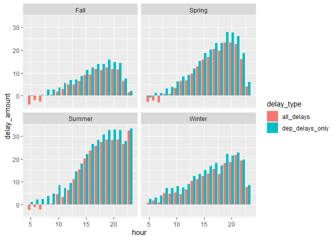
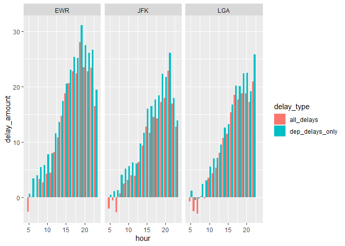
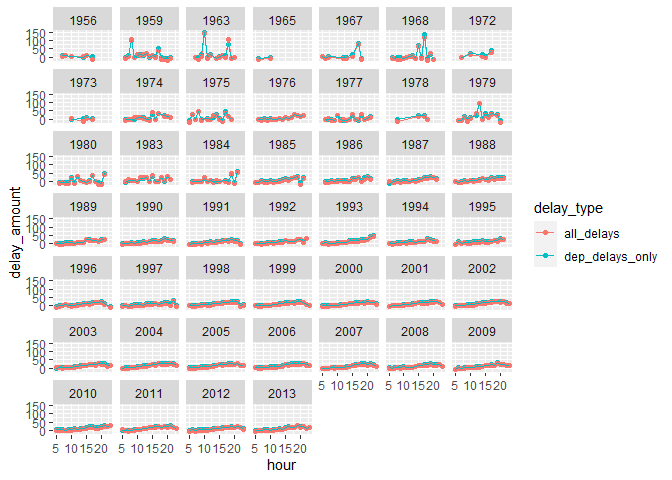

HW Week 5
================
Nolan Wark
10/12/2022

# Introduction

IF you want to know what time of day you should fly to avoid delays as
much as possible depending on season, origin airport, or plane’s
manufacturing year. All graphs and summary tables have
“dep\_delays\_only” which only takes into account departure delays and
“all\_delays” which takes into account both departure and arrival
delays. For almost every season, origin aritport, and plane
manufacturing year they fallow a similar pattern. The pattern is almost
no delays in the morning with delays growing through out the day and
smaller delays after about 9-10PM to midnight.

If looking at seasons winter has worse delays in the morning than any
other season, and summer has the worst afternoon and night compared to
the others. If looking at origin airport, LGA has the longest time in
the morning before the delays start to increase, but it also does not
have a decrease in the late afternoon to midnight like the other two
origins. If looking at the maufacturing year of a plane, it seems to not
have much of an effect with time of the day on delays, some years do not
experience the decreasing of delays in the late afternoon to midnight
and other years have too few points to try to make a claim on.

## Setup

``` r
library(nycflights13)
```

    ## Warning: package 'nycflights13' was built under R version 3.6.3

``` r
library(dplyr)
```

    ## Warning: package 'dplyr' was built under R version 3.6.3

    ## 
    ## Attaching package: 'dplyr'

    ## The following objects are masked from 'package:stats':
    ## 
    ##     filter, lag

    ## The following objects are masked from 'package:base':
    ## 
    ##     intersect, setdiff, setequal, union

``` r
library(ggplot2)
library(tidyr)
```

    ## Warning: package 'tidyr' was built under R version 3.6.3

``` r
options(dplyr.summarise.inform = FALSE)
```

``` r
#Data
# flights
# airlines
# airports
# planes
# unique(planes$year)
# weather
```

  - 
# Delays be seasons

``` r
spring_date = as.POSIXct("2013-03-20 01:00:00", tz = "America/New_York")
summer_date = as.POSIXct("2013-06-20 01:00:00", tz = "America/New_York")
fall_date = as.POSIXct("2013-09-22 01:00:00", tz = "America/New_York")
winter_date = as.POSIXct("2013-12-21 01:00:00", tz = "America/New_York")


seasons_flights = flights %>% 
  left_join(rename(select(airports, faa, tzone), origin = faa), by="origin") %>% 
  mutate(season = ifelse(test = time_hour < spring_date, 
                         yes = "Winter", 
                         no = 
                           ifelse(test = time_hour < summer_date, 
                                  yes = "Spring",
                                  no = 
                                    ifelse(test = time_hour < fall_date,
                                           yes = "Summer",
                                           no = 
                                             ifelse(test = time_hour < winter_date, 
                                                    yes = "Fall", 
                                                    no = "Winter"))))) %>% 
  group_by(season, hour) %>% 
  summarise(dep_delays_only = mean(dep_delay, na.rm = T),
            all_delays = (sum(dep_delay, na.rm = TRUE) + sum(arr_delay, na.rm = TRUE)) / (sum(!is.na(dep_delay)) + sum(!is.na(arr_delay)))) %>% 
  arrange(factor(season, levels=c("Spring", "Summer", "Fall", "Winter")))

seasons_flights
```

    ## # A tibble: 77 x 4
    ## # Groups:   season [4]
    ##    season  hour dep_delays_only all_delays
    ##    <chr>  <dbl>           <dbl>      <dbl>
    ##  1 Spring     5          -0.684     -2.67 
    ##  2 Spring     6           1.11      -2.12 
    ##  3 Spring     7           1.18      -2.88 
    ##  4 Spring     8           3.25       0.728
    ##  5 Spring     9           3.73       0.808
    ##  6 Spring    10           6.17       3.34 
    ##  7 Spring    11           8.42       6.40 
    ##  8 Spring    12           9.05       6.64 
    ##  9 Spring    13          11.9        9.71 
    ## 10 Spring    14          15.1       12.8  
    ## # ... with 67 more rows

``` r
seasons_flights %>% 
  pivot_longer(cols=c('dep_delays_only', 'all_delays'),
                names_to='delay_type',
                values_to='delay_amount') %>%
  drop_na(delay_amount) %>% 
  ggplot(aes(fill=delay_type, x=hour, y=delay_amount)) +
    geom_bar(position = 'dodge', stat='identity') +
    facet_wrap(vars(season))
```

<!-- -->

  - For all seasons, to avoid avoid delays as much as possible try to
    depart before about 10AM, if the season is winter try to get a plane
    that departs before 8AM. For all seasons but Summer, delays quickely
    start to become smaller after 8PM-9PM, however for summer it stays
    high till the end. Fall is the best season to avoid dealays in
    general but all season fallow a simialar pattern of dealays becoming
    longer as the day progresses.

# Delays by origin airport

``` r
org_airport_flights = flights %>% 
  group_by(origin, hour) %>% 
  summarise(dep_delays_only = mean(dep_delay, na.rm = T),
            all_delays = (sum(dep_delay, na.rm = TRUE) + sum(arr_delay, na.rm = TRUE)) / (sum(!is.na(dep_delay)) + sum(!is.na(arr_delay))))

org_airport_flights
```

    ## # A tibble: 57 x 4
    ## # Groups:   origin [3]
    ##    origin  hour dep_delays_only all_delays
    ##    <chr>  <dbl>           <dbl>      <dbl>
    ##  1 EWR        1         NaN       NaN     
    ##  2 EWR        5           0.649    -2.55  
    ##  3 EWR        6           3.50      0.117 
    ##  4 EWR        7           4.04      0.0447
    ##  5 EWR        8           5.50      3.35  
    ##  6 EWR        9           5.84      2.74  
    ##  7 EWR       10           7.79      4.30  
    ##  8 EWR       11           7.96      4.50  
    ##  9 EWR       12          11.6       8.17  
    ## 10 EWR       13          13.6      10.9   
    ## # ... with 47 more rows

``` r
org_airport_flights %>% 
  pivot_longer(cols=c('dep_delays_only', 'all_delays'),
                names_to='delay_type',
                values_to='delay_amount') %>% 
  drop_na(delay_amount) %>% 
  ggplot(aes(fill=delay_type, x=hour, y=delay_amount)) +
    geom_bar(position = 'dodge', stat='identity') + 
    facet_wrap(vars(origin))
```

<!-- -->

  - All three airports fallow a similar pattern of almost no delays in
    the morning with the dealays becoming longer as the day progresses.
    But for EWR and JFK at about 8PM the delays start to become shorter,
    while LGA’s delays stay about the same from about 5PM to midnight.

# Delays by plane manufactured year

``` r
man_year_flights = flights %>% 
  left_join(rename(select(planes, tailnum, year), year_manufactured = year), by="tailnum") %>% 
  drop_na(year_manufactured) %>% 
  group_by(year_manufactured, hour) %>% 
  summarise(dep_delays_only = mean(dep_delay, na.rm = T),
            all_delays = (sum(dep_delay, na.rm = TRUE) + sum(arr_delay, na.rm = TRUE)) / (sum(!is.na(dep_delay)) + sum(!is.na(arr_delay))))

man_year_flights
```

    ## # A tibble: 726 x 4
    ## # Groups:   year_manufactured [46]
    ##    year_manufactured  hour dep_delays_only all_delays
    ##                <int> <dbl>           <dbl>      <dbl>
    ##  1              1956     7            8.33       4.67
    ##  2              1956     8            8          9.5 
    ##  3              1956    10            5          3.5 
    ##  4              1956    14           -3          1.5 
    ##  5              1956    15            7.6       11.8 
    ##  6              1956    17            2.5      -12.4 
    ##  7              1959     6           -4.29      -6.07
    ##  8              1959     7            6.93       2.7 
    ##  9              1959     8           98.5      104.  
    ## 10              1959     9           -1.47      -4.26
    ## # ... with 716 more rows

``` r
man_year_flights %>% 
  pivot_longer(cols=c('dep_delays_only', 'all_delays'),
                names_to='delay_type',
                values_to='delay_amount') %>% 
  drop_na(delay_amount) %>% 
  ggplot(aes(color=delay_type, x=hour, y=delay_amount)) +
    geom_point() +
    geom_line() +
    facet_wrap(vars(year_manufactured))
```

<!-- -->

  - Almost all plane manuafturing years have the same trend of having
    delay times increase throguht the day with a small decreasing fall
    off around 8-9PM through midnight. It looks like there is not as
    much data for planes with manufacturing years 1984 and before which
    is why they have jumps between points and fewer points on the chart,
    so it is harder to make claims about them. it looks like planes with
    manufacturing years of 1976, 1977, 1992, 1993, and 2010 do not have
    a falling of dealy times after about 9PM like most other
    manufacturing
years.

<!-- #Testing -->

<!-- ```{r} -->

<!-- rename(select(airports, faa, tzone), dest = faa) -->

<!-- flights$time_hour[1] < as.POSIXct("2013-01-01", tz = "America/New_York") -->

<!-- ``` -->
